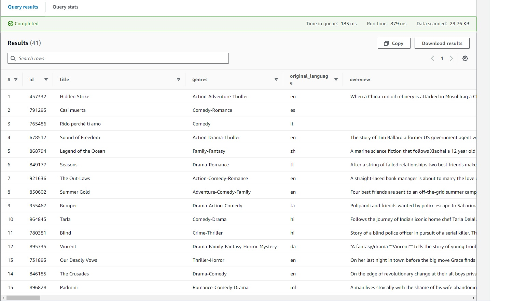

# Kaggle Data Extraction with Airflow
 This project demonstrates how to use Apache Airflow to automate the process of extracting data from Kaggle. It provides a robust and scalable solution for retrieving dataset files, partitioning the data, and storing it in both an S3 bucket and a PostgreSQL database.

Keywords: Airflow, Python, AWS RDS, AWS S3, Postgres Database, Data lake, Kaggle, API, Docker

## Features
* Automatically collects inputs from the user, such as the dataset topic, filters (hottest, newest), and the desired quantity of datasets to download.
* Downloads the dataset files locally using the Kaggle API.
* Partitions the downloaded data into YYYY/MM/DD format for efficient storage and retrieval.
* Stores the raw CSV files in an S3 bucket for long-term data archival.
* Transforms the raw data into the more efficient Parquet file format.
* Stores the transformed Parquet files in the same S3 bucket.
* Loads both the raw and transformed data into an RDS database for further analysis or querying.
* Utilizes the powerful scheduling capabilities of Airflow to automate the data extraction process.

## Prerequisites

Make sure you have Docker installed 

[download docker here](https://www.docker.com/products/docker-desktop/)

Furthermore, running docker require to download a wsl and a distro, like Ubuntu, from linux to work properly.

## Installation
Clone this repository to your local machine.

`git clone https://github.com/leonardohss0/kaggle-airflow-aws.git`

Install the required Python packages using pip.

`pip install -r requirements.txt`

## Configuration

Make sure you have your Kaggle API credentials ready and placed in the appropriate directory (e.g., ~/.kaggle/kaggle.json). In this case, you can set your credentials using Airflow UI and set it as 'kaggle_conn'

Configure the Airflow DAGs and connections based on your specific requirements. Edit the respective files in the dags/ directory.

## Usage
1. Open Docker
2. Reach the folder musing your terminal and run `docker-compose build', 'docker-compose up -d'
3. Access the Airflow UI at airflow webserver --port 8080. You can access the Airflow web interface using http://localhost:8080 in your web browser.
4. Trigger the DAG for data extraction from the Airflow web interface, providing the necessary inputs such as the dataset topic, filters (hottest, newest), and the desired quantity of datasets to download.
5. Monitor the progress of the DAG and check the extracted data files in the configured S3 bucket. You can also view the transformed Parquet files and check the stored records in the RDS database.

## Materials
### Analysing the data in the Datalake with AWS Athena

### Datalake structure in AWS S3
bucket/ schema/ YYYY/ MM/ DD/ file.csv

## Contributing
Contributions are welcome! If you find any issues or have suggestions for improvements, please feel free to open an issue or submit a pull request.

## License
This project is licensed under the MIT License. You are free to modify and distribute the code as per the terms of this license.